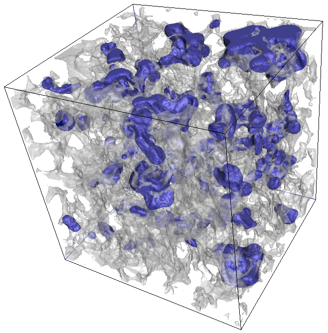

# lsmpqs-1.0: Level set methods for quasi-static simulation

Library to perform level set simulation on 3 dimensional images. Generates fluid configurations for 2 phase flow.
Parallelization implemented using OpenMP, and connectivity algorithms implemented using union-find algorithms.

